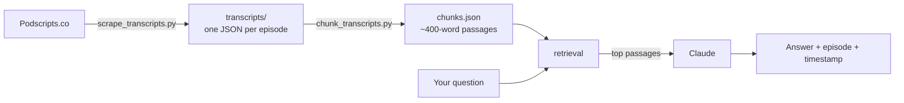

# 10% Happier Explorer

<!-- COVER IMAGE: drop a screenshot of the chatbot answering a question here.
     Save it as docs/cover.png in the repo, then replace this comment with:
       -->

**Ask a question, get an answer grounded in what people actually said on the *10% Happier*
podcast — with the episode and timestamp, so you can go listen to it yourself.**

## The problem

I've listened to a lot of this podcast. Somewhere in there, a guest said the thing about anxiety
that I wanted to send to a friend — and I could not find it. Podcast apps let you search titles and
descriptions. They do not let you search what was *said*. Eleven hundred episodes, and the useful
part is locked inside the audio.

So I built the search that should already exist.

## How it works



Ad and sponsor segments get filtered out during chunking, so the bot doesn't confidently quote a
mattress commercial at you.

## Running it yourself

You'll need Python 3 and an [Anthropic API key](https://console.anthropic.com/). If you've never
used Terminal before, that's fine — every step below is copy-paste.

```bash
git clone https://github.com/lauradcampbell/happier-explorer.git
cd happier-chatbot
python3 -m venv venv && source venv/bin/activate
pip install -r requirements.txt
```

**1. Get the transcripts** (~30 minutes — there's a polite 1.5s pause between requests, and it's
safe to stop and re-run, it skips what it already has):

```bash
python scrape_transcripts.py
```

**2. Build the searchable chunks:**

```bash
python chunk_transcripts.py
```

**3. Ask it things:**

```bash
export ANTHROPIC_API_KEY="your-key-here"
python chatbot.py
```

Roughly $0.01–0.02 per question.

## Deploying it so you can use it on your phone

`chatbot_cloud.py` is a password-protected web version with a daily question cap, built to run on
[Railway](https://railway.app/)'s free tier. Full walkthrough in [DEPLOY.md](DEPLOY.md).

## A note on the transcripts

The transcripts belong to the podcast, not to me. This repo contains the pipeline, not the data —
running step 1 fetches your own copy. Be nice to Podscripts.co and leave the delay in.

## Built with

Python, [Claude](https://www.anthropic.com/claude), BeautifulSoup, and a stubborn refusal to accept
that podcast search is that bad.
